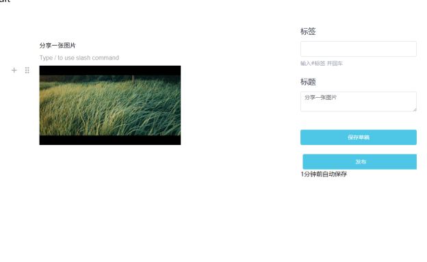
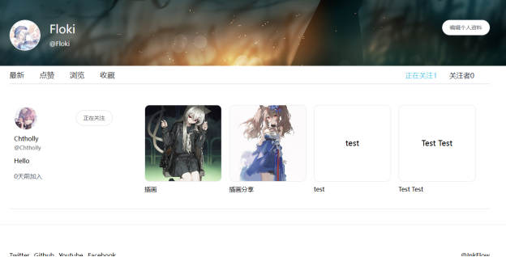
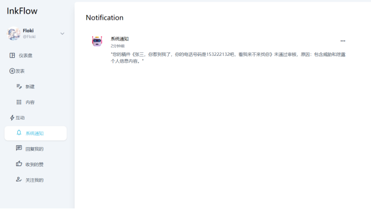

# InkFlow ✒️ - 内容分享社区平台

<div align="center">

**现代化的内容分享社区 | Go + Vue 3**

[](https://go.dev/)
[](https://vuejs.org/)
[](LICENSE)

</div>

## 📖 项目简介

InkFlow 是一个使用 **Go + Gin + GORM** 构建的内容分享社区平台，支持内容创作、AI 审核、评论互动、个性化推荐等功能。采用 DDD 架构和事件驱动设计，集成 Temporal 工作流、Gorse 推荐引擎、Kafka 消息队列、Meilisearch 全文搜索等技术栈。

---

## 🚀 一键部署（Docker Compose）

### 环境要求

- Docker 20.10+
- Docker Compose v2+
- 至少 4GB 内存

### 快速开始

```bash
# 1. 克隆项目
git clone https://github.com/KNICEX/InkFlow.git
cd InkFlow

# 2. 创建配置文件
cp config/config.temp.yaml config/config.yaml

# 3. 修改配置（Docker 环境地址）
# 将 localhost 改为服务名，端口改为内部端口，详见下方配置说明

# 4. 一键启动所有服务
docker compose up -d

# 5. 查看服务状态
docker compose ps
```

### Docker 环境配置文件

创建 `config/config.yaml`，使用 Docker 服务名：

```yaml
postgres:
  dsn: "host=postgres user=root password=root dbname=ink_flow port=5432"

redis:
  addr: redis:6379
  password: ""

meilisearch:
  addr: http://meilisearch:7700
  master_key: inkflow

kafka:
  addrs:
    - kafka:9092

otel:
  grpc:
    endpoint: jeager:4317
    insecure: true

temporal:
  addr: temporal:7233
  namespace: inkflow
  domain: default

gorse:
  addr: http://gorse:8088
  api_key: inkflow

# 自行判断使用email smtp端口 25/465/587
email:
  smtp:
    username: your_email@qq.com
    password: your_smtp_password
    port: 25
    host: smtp.qq.com
    from_name: InkFlow

llm:
  gemini:
    key:
      - your_gemini_api_key
#  cloudinary官网免费图床
file:
  cloudinary:
    key: your_key
    secret: your_secret
    cloud_name: your_cloud_name
```

### 分步构建（资源受限时）

```bash
# 分别构建镜像
docker compose build backend
docker compose build frontend
docker compose build temporal

# 启动服务
docker compose up -d
```

### 服务访问地址

| 服务 | 地址 | 说明 |
|------|------|------|
| 前端 | http://localhost | 主站入口 |
| 后端 API | http://localhost:8080 | API 服务 |
| Grafana | http://localhost:3000 | 监控面板 |
| Kafka UI | http://localhost:18080 | Kafka 管理 |
| Jaeger | http://localhost:16686 | 链路追踪 |
| Temporal | http://localhost:8233 | 工作流管理 |
| Meilisearch | http://localhost:7700 | 搜索服务 |
| Prometheus | http://localhost:9090 | 指标监控 |

### 常用命令

```bash
# 查看日志
docker compose logs -f backend
docker compose logs -f frontend

# 重启服务
docker compose restart backend

# 停止所有服务
docker compose down

# 停止并清理数据
docker compose down -v
```

---

## 🛠️ 本地开发

### 环境依赖

- Go 1.24.0+
- Node.js 18+ / pnpm
- Docker

### 后端开发

```bash
# 启动依赖服务
docker compose up -d postgres redis kafka meilisearch

# 运行后端
go run main.go
```

### 前端开发

```bash
cd ink-flow-web
pnpm install
pnpm dev
```

---

## ✨ 核心功能

| 功能 | 说明 |
|------|------|
| 📝 内容创作 | Markdown 编辑器、草稿自动保存、图片上传 |
| 🤖 AI 审核 | Gemini AI 内容审核、自动标签生成 |
| 🎯 个性化推荐 | Gorse 推荐引擎、协同过滤算法 |
| 🔍 全文搜索 | Meilisearch 毫秒级搜索 |
| 📊 Feed 流 | 推拉结合、关注流/推荐流/热门流 |
| 💬 社交互动 | 多级评论、点赞收藏、关注系统 |
| 🔔 通知系统 | 实时通知、已读管理 |
| 📈 可观测性 | Prometheus + Grafana + Jaeger |

---

## 🏗️ 技术栈

**后端**：Go 1.24 / Gin / GORM / PostgreSQL / Redis / Kafka / Temporal / Meilisearch / Gorse

**前端**：Vue 3 / TypeScript / Pinia / Element Plus / Milkdown

**运维**：Docker / Prometheus / Grafana / Jaeger

---

## 📚 文档

详细技术文档请访问 Wiki：[https://deepwiki.com/KNICEX/InkFlow](https://deepwiki.com/KNICEX/InkFlow)

---

## 🖼️ 界面预览

<details>
<summary>点击展开截图</summary>

#### 首页 Feed 流


#### 内容编辑器


#### 搜索与标签


#### 通知中心


</details>

---

## 📄 License

[MIT License](LICENSE)
